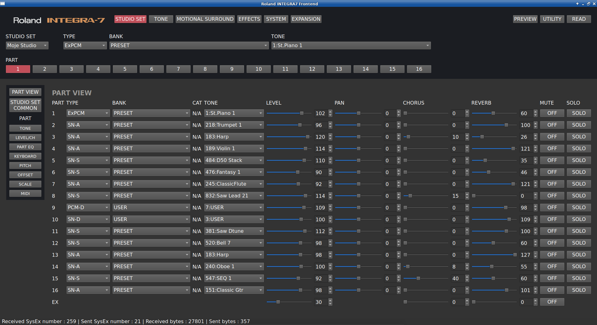

# Integra7Frontend

A Roland INTEGRA7 sound module parameter editor for Linux

[](https://www.gnu.org/licenses/gpl-3.0)

## Description

Integra7Frontend is a Qt application providing parameter editing of Roland INTEGRA7 sound module
through MIDI SysEx commands. Communication with the module is done via subscription to ALSA sequencer ports
representing INTEGRA7 device. 

Connection to the device is not automatic. Upon application start up user must select ALSA sequencer port representing 
INTEGRA7 device (either Synth or Control) and click Connect.
Then click READ (upper right corner) to download actual state from the device into the application.

Data exchange is bidirectional. Changes done from the device panel are updated in the application and vice versa automatically.

Most of the commonly used parameters are implemented. There might be some bugs mainly regarding tone data editing.

Application is Linux only. Porting to other platforms might be possible however users of commercial operating systems 
have appropriate official tools available.



## Build

```shell
git clone
cd Integra7Frontend
cmake -S src -B build
cmake --build -S src -B build
```

## Author

Miroslav Kovac (mixxoo@gmail.com)
